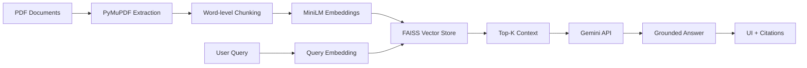

# DRetrieval-Augmented Document Intelligence

A highly efficient, strictly grounded Retrieval-Augmented Generation (RAG) application optimized for local CPU inference and zero-cost operation.

## Overview
This project implements a complete RAG pipeline capable of ingesting PDF documents, semantically retrieving relevant context, and generating grounded natural language answers. It is specifically engineered to run efficiently on standard consumer hardware (e.g., 16GB RAM, no dedicated GPU) by utilizing lightweight models and efficient vector indexing.

## Key Features
- **Local CPU-Optimized Embedding**: Uses `all-MiniLM-L6-v2` for blazing fast, local dense vector generation.
- **In-Memory Vector Search**: Implements `FAISS` for low-latency, scalable similarity search without requiring cloud infrastructure.
- **Strictly Grounded Generation**: Prompts the LLM to strictly rely on retrieved context, gracefully handling out-of-domain queries by refusing to hallucinate.
- **Source Attribution**: Transparently displays the exact document, page number, and text chunk that informed the generated answer.
- **Polished UI**: A clean, responsive Streamlit interface built for usability.

## Architecture



## Technology Stack
- **Language**: Python 3
- **Frontend**: Streamlit
- **Document Processing**: PyMuPDF (`fitz`)
- **Embeddings**: `sentence-transformers`
- **Vector Database**: `faiss-cpu`
- **LLM**: Google Gemini API (`google-genai`)

## Project Structure
```text
project-root/
├── app/
│   ├── ingestion/       # PDF text extraction and chunking
│   ├── retrieval/       # FAISS index and embeddings
│   ├── generation/      # LLM prompting and API integration
│   ├── evaluation/      # Recall@K metrics script
│   └── utils/
├── data/                # Local persistent FAISS index storage
├── app.py               # Streamlit entry point
├── requirements.txt
└── .env.example
```

## Setup Instructions

1. **Clone the repository** (or navigate to the project directory).
2. **Create a virtual environment**:
   ```bash
   python -m venv venv
   source venv/bin/activate  # On Windows: venv\\Scripts\\activate
   ```
3. **Install dependencies**:
   ```bash
   pip install -r requirements.txt
   ```
4. **Configure Environment Variables**:
   Copy `.env.example` to `.env` and insert your Gemini API Key. (You can acquire a free tier key from Google AI Studio).
   ```bash
   cp .env.example .env
   ```

## Running the Application

Execute the Streamlit application:
```bash
streamlit run app.py
```

## Evaluation Methodology

The project includes a lightweight evaluation framework (`app/evaluation/evaluate.py`) designed to measure **Recall@K**. 
The evaluation process involves:
1. Ingesting a known corpus of documents.
2. Querying the FAISS index with synthetic questions mapped to ground-truth documents.
3. Calculating the percentage of times the expected document appears in the Top-K retrieved chunks.

*Note: Results are hardware and dataset dependent. For demonstration, populate `eval_dataset` in the evaluation script to see exact metrics.*

## Limitations
- **PDF Formatting**: Extremely complex PDF layouts (e.g., multi-column academic papers with dense tables) may confuse the basic word-level chunking.
- **Dependency on LLM API**: While embeddings and retrieval run 100% locally on CPU, generation relies on the external Gemini API (free tier).

## Future Improvements
- Implement Hybrid Search (BM25 + FAISS) with Reciprocal Rank Fusion (RRF).
- Add support for semantic chunking instead of naive word-count chunking.
- Integrate a local 1B parameter model (e.g., Llama 3.2 1B via Ollama) for entirely offline generation.
